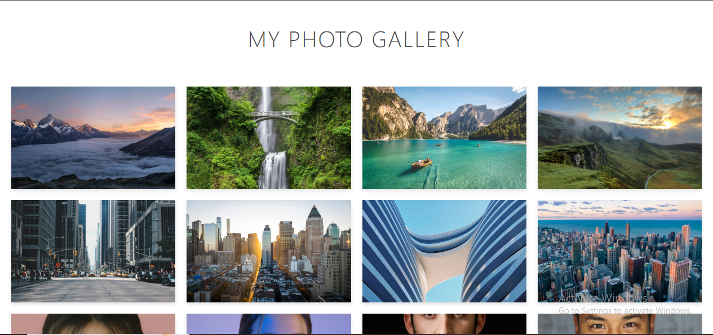

# My Photo Gallery

A responsive, interactive photo gallery with a clean and modern design. Features smooth hover effects, lightbox viewing, and keyboard navigation.



## ✨ Features

- **Clean Design**: Minimalist white background with dark gray heading
- **Responsive Grid Layout**: 4 columns × 5 rows (20 photos total)
- **5 Curated Themes**:
  - 🏔️ Nature & Landscapes
  - 🏙️ Architecture & City
  - 👤 People & Portraits
  - 🦁 Animals & Wildlife
  - 🍽️ Food & Culinary
- **High-Quality Images**: All photos are 1600×1000 resolution
- **Smooth Hover Effects**: Images zoom in elegantly on hover
- **Lightbox Viewer**: Click any image to view in full-screen mode
- **Keyboard Navigation**: 
  - `←` / `→` Arrow keys to navigate between images
  - `Esc` to close lightbox
- **Touch-Friendly**: Works seamlessly on mobile devices
- **No External Dependencies**: Pure HTML, CSS, and JavaScript

## 🚀 Technologies Used

- **HTML5** - Semantic structure
- **CSS3** - Modern styling with Grid layout
- **JavaScript (ES6+)** - Interactive functionality
- **Unsplash API** - High-quality free images

## 📦 Installation

1. Clone the repository:
```
git clone https://github.com/yourusername/my-photo-gallery.git
cd my-photo-gallery
```

2. Open index.html in your web browser:
```
# You can simply double-click the file
# Or use a local server (recommended):
python -m http.server 8000
# Then visit http://localhost:8000
```

3. 📁 Project Structure
```
my-photo-gallery/
├── index.html          # Main HTML file
├── README.md           # Project documentation
└── screenshot.png      # Project screenshot (optional)
```

4. 🎨 Customization
### Changing Images
To replace images with your own, modify the images array in the <script> section of index.html:
```
const images = [
    {
        src: 'path/to/your/image.jpg',
        theme: 'Your Theme Name',
        title: 'Your Image Title'
    },
    // Add more images...
];
```

### Adjusting Grid Layout
To change the number of columns, modify the CSS Grid in style.css:
```
.gallery-grid {
    grid-template-columns: repeat(4, 1fr); /* Change '4' to desired columns */
}
```

### Changing Colors
Update the color variables in the CSS:
```
.header h1 {
    color: #4a4a4a; /* Change to your preferred color */
}

body {
    background-color: #ffffff; /* Change background color */
}
```
### 🖼️ Image Sources
All images are sourced from Unsplash - a free high-quality photo library.
### 🌐 Browser Support
- Chrome (latest)
- Firefox (latest)
- Safari (latest)
- Edge (latest)
- Mobile browsers (iOS Safari, Chrome Mobile)
### 📱 Responsive Breakpoints
- Desktop: 4 columns (> 1200px)
- Tablet: 3 columns (900px - 1200px)
- Small Tablet: 2 columns (600px - 900px)
- Mobile: 1 column (< 600px)
### 🔧 Features in Detail
#### Hover Effect
Images smoothly scale to 1.1x on hover with a 0.4s transition, creating an engaging user experience.
#### Lightbox Modal
- Dark overlay background (95% opacity)
- Full-screen image viewing
- Image information display
- Smooth transitions
#### Navigation Controls
- Previous/Next buttons for easy browsing
- Circular button design with hover effects
- Keyboard shortcuts for power users
- Click outside image to close
### 🤝 Contributing
Contributions are welcome! Please feel free to submit a Pull Request.
- Fork the repository
- Create your feature branch (```git checkout -b feature/AmazingFeature```)
- Commit your changes (```git commit -m 'Add some AmazingFeature'```)
- Push to the branch (```git push origin feature/AmazingFeature```)
- Open a Pull Request
### 📝 License
This project is open source and available under the MIT License.
### 👨‍ Author
- Sowhom Ghosh
- GitHub: [@Sowhom638](https://github.com/Sowhom638)
- Email: [EMAIL_ADDRESS](ghoshsowhom638@gmail.com)
### 🙏 Acknowledgments
- Unsplash for beautiful free images
- MDN Web Docs for documentation
- All contributors and supporters
### 📞 Support
If you have any questions or feedback, please open an issue in the repository.
